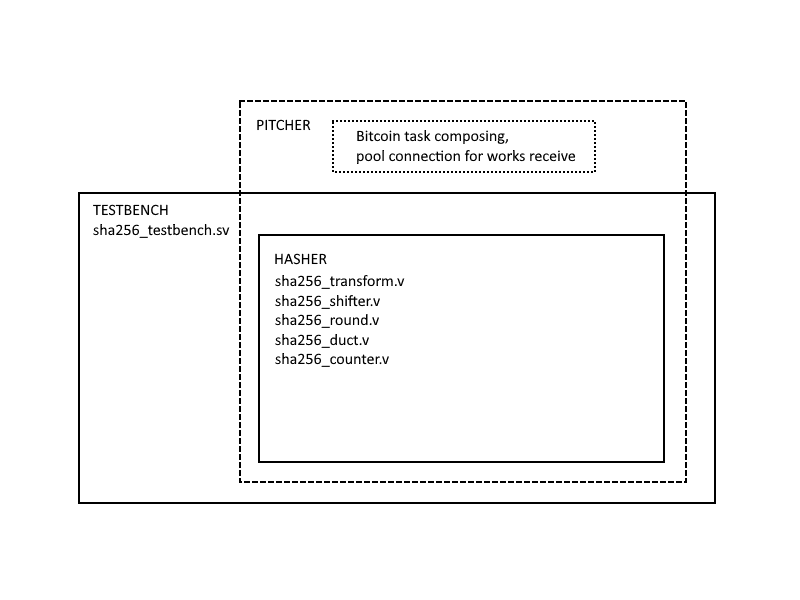

# Bitcoin mining SHA256 pipelined hasher
## FPGA hasher
Calculates the message hash from the sequence of prepared 512-bit data blocks and compares it with the given template, processing each data block requires 64 clock cycles.
It can be used separately as an IP block as well as a bitcoin miner part.
The design feature is a complete pipelin, i.e. it allows you to reuse pieces of combinatorial logic.
The SHA algorithm has 64 identical calculations in a row. That is, it is possible to significantly reduce the number of logic gate, which means to reduce the entire circuit, to take a cheaper FPGA of a smaller size, which means to reduce the costs and payback period of the miner. And also raise the frequency since each individual gate can run much faster than the entire long chain of combinatorial logic.
The project is implemented in the Quartus development environment. 
## The project part links:
- [Hasher SHA256](https://github.com/botnursery/METRICSgit/tree/master/sha2)
- [Testbench for one hasher](https://github.com/botnursery/METRICSgit/tree/master/testbenches)
- [Pitcher for tasks (nonces) distribution and parallelization of calculations] TBU

